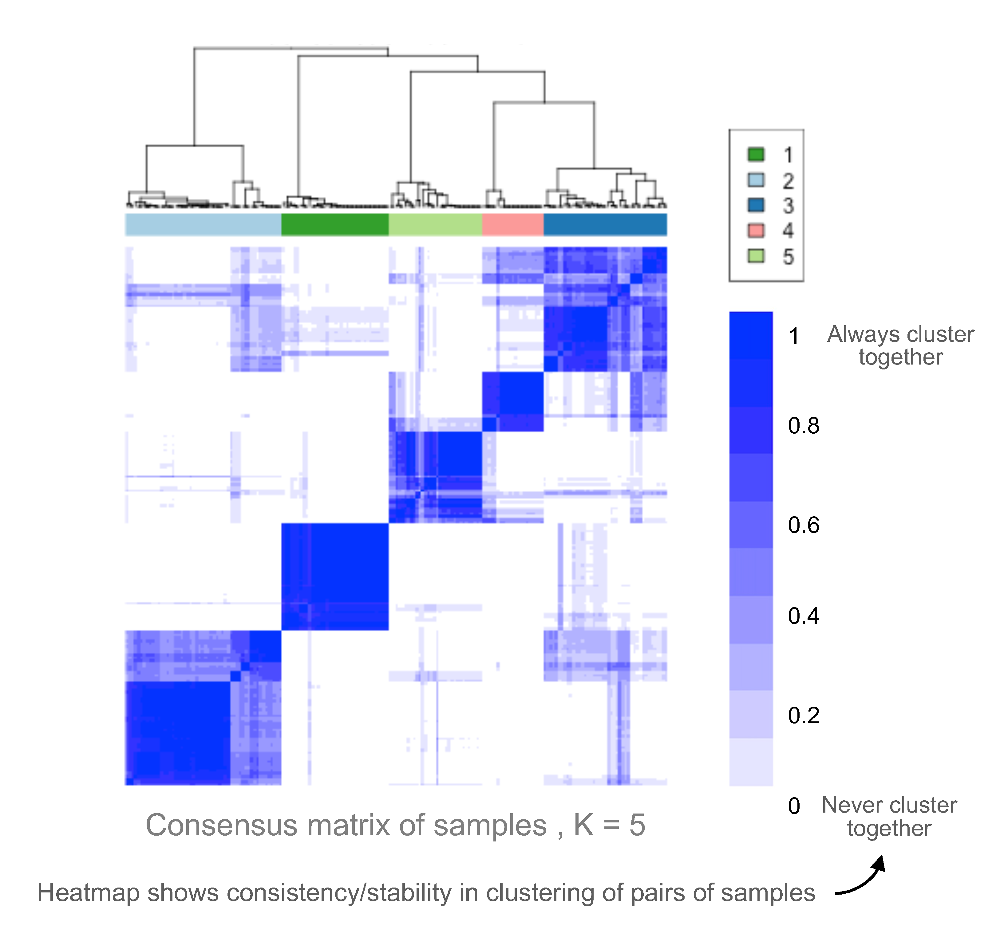
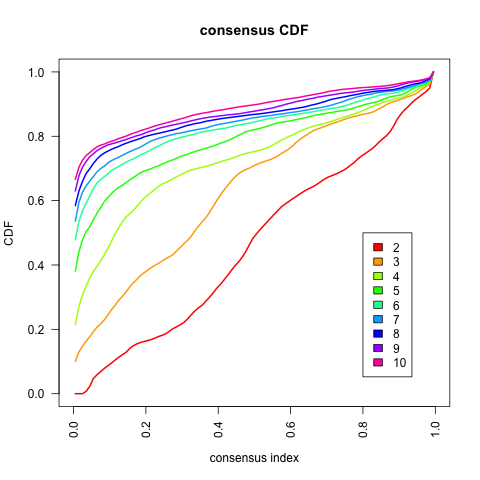

# consensusClustR

[Consensus clustering](https://link.springer.com/article/10.1023/A:1023949509487) is a resampling-based method for discovering robust sample or feature clusters like stable patient subtypes and their (molecular) signatures. It addresses challenges in traditional clustering such as determining the correct number of clusters and assessing their stability.  

## Interpreting Consensus Matrix, CDF, and Delta Area Plots

Consensus clustering evaluates cluster stability across repeated (sample) sub-sampling to identify the optimal number of clusters (`K`). Three visualizations guide this decision:  

### 1. Consensus matrix

The consensus matrix is a heatmap showing how frequently each pair of samples clusters together across all iterations:
- **Values close to 1 (dark blue)**: Highly stable associations showing sample pairs that *always* cluster together  
- **Values close to 0 (white)**: Sample pairs that *never* cluster together and clearly belong to different clusters   
- **Intermediate values**: Sample pairs with ambiguous cluster membership   

   

An ideal consensus matrix has a clear block-diagonal structure with distinct dark squares (stable clusters) and white off-diagonal regions (clear separation). Gradual color transitions indicate unstable or arbitrary cluster boundaries.  

### 2. Cumulative Distribution Function (CDF) Plot

The CDF plot shows the distribution of consensus values across all sample pairs for each `K` value.  

  

The x-axis represents the consensus values from 0 (samples never cluster together) to 1 (always cluster together); and the y-axis (CDF, 0-1) shows the cumulative proportion of sample pairs with consensus ≤ x.

What do these curves mean?   

- **Initial rise + flat middle + final rise**: Ideal curve with many pairs at 0 (separate clusters), few pairs in the middle (minimal ambiguity) and many pairs at 1 (stable within-cluster associations).  
- **Gradual, diagonal line**: Poor clustering; many intermediate consensus values showing samples don't consistently cluster together or separate.  

For small `K` (2-4), the curves are gradual and indicate poor separation. Optimal `K` would be the first `K` where the curve becomes steep initially and is S-shaped. Beyond the optimal `K`, curves usually overlap, indicating diminishing returns (adding clusters doesn't improve stability).  

### 3. Delta area or elbow plot

The elbow plot shows the relative gain in cluster stability with increasing number of clusters `K`. It can help identify the point where adding more clusters stops providing meaningful improvements.

  

The y-axis represents additional gain in cluster stability obtained by increasing `K`. Larger values indicate substantial improvements in stability, whereas flattening of the curve (after elbow point) suggests diminishing improvements and that adding more clusters may not capture a meaningful data structure.  

The optimal number of clusters is evaluated using all these plots and, in practice, they help narrow down the selection to 2-3 candidate `K` values. The final choice must be guided by biological relevance, cluster stability, and reasonable cluster sizes. Meaningful clusters would show distinct molecular or clinical patterns rather than small noisy subgroups.

---

This repo is an R workflow for performing consensus clustering using `ConsensusClusterPlus`   
  - locally, for smaller expression matrices, or
  - on an HPC cluster for large (genomic) data.  

**See `consensusWorkflow.md` (or, if you prefer R, `consensusWorkflow.rmd`) for instructions on running the analysis.**

Right now the workflow is optimized for clustering expression (numeric) data. If features include a mix of categorical and continuous features, you can plug in a custom distance function.  
